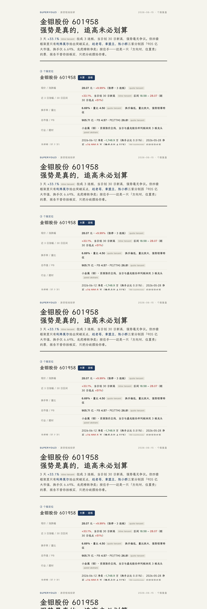
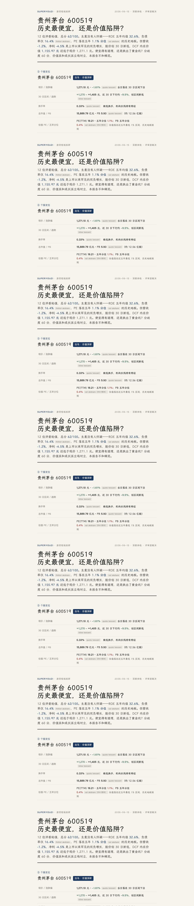
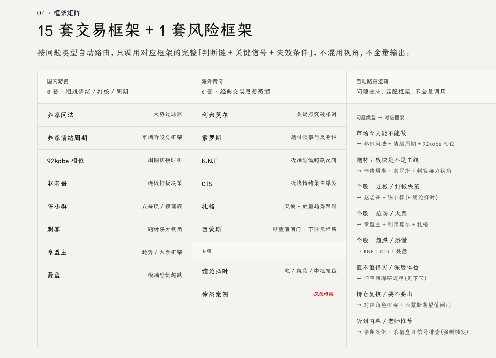

# superyouziskills

**给 AI 助手使用的 A 股投研 Skill。** 它把市场复盘、个股分析和风险排查所需的研究框架、数据脚本与报告模板组织在一起，让助手按照「取数 → 选择框架 → 分析 → 输出报告」的流程工作。

安装后，你可以直接用自然语言提问。助手会读取对应的框架文件，调用 Python 脚本获取数据，再给出带来源、情景预案和证伪条件的分析。这里的「证伪条件」指：出现什么新数据或信号时，原来的判断就不再成立。

项目包含 **15 套交易框架、1 套风险框架、28 份深研评审档案**，以及行情、财务、估值等数据脚本。它需要运行在支持 Skill 的 AI 助手中；项目本身不提供大模型服务，也不连接交易账户或执行下单。


## 能做什么

| 场景 | 分析内容 |
| --- | --- |
| 市场复盘 | 涨停分布、连板高度、题材聚集与市场情绪 |
| 题材梳理 | 板块强弱、主线线索和资金关注方向 |
| 个股分析 | 根据连板、趋势、超跌等特征选择框架，梳理机会、风险和情景预案 |
| 深度研究 | 结合财务历史、估值、股东结构与简化 DCF 模型，呈现不同研究视角的判断和分歧 |
| 持仓复核 | 重新检查原有逻辑、仓位风险和判断失效条件 |
| 风险排查 | 检查异常交易线索、群荐股话术等风险信号，区分已知事实与待核实信息 |

完整分析会输出对话内报告和 HTML 文件。HTML 可以用浏览器查看、打印或分享；历史样报见 [docs/examples](docs/examples)，其中的数据不代表当前行情。

## 报告预览

下面是三种报告的历史样例，点击图片可查看大图。样例仅展示报告结构与排版，其中的数据和判断不代表当前行情。

| 市场情绪 | 个股复盘 | 深度体检 |
| --- | --- | --- |
| [](docs/examples/样报-市场情绪.png) | [](docs/examples/样报-个股复盘.png) | [](docs/examples/样报-深度体检.png) |
| 情绪阶段、涨停分布与题材线索 | 角色定位、框架会诊与情景预案 | 财务估值、模型假设与评审分歧 |

HTML 文件：[市场情绪](docs/examples/样报-市场情绪.html) · [个股复盘](docs/examples/样报-个股复盘.html) · [深度体检](docs/examples/样报-深度体检.html)。下载后可在浏览器打开；保留仓库目录结构以加载本地字体。

## 框架与评审如何工作

普通复盘按问题选择少量相关框架，避免把所有方法同时套在一个标的上。深度研究则读取不同流派的评审档案，由 AI 按档案中的评分规则分析数据，展示分歧与依据。**这些评委是研究视角，不是 28 位真人参与，也不是 28 个独立模型。**

人物框架根据公开资料整理，注明来源与资料局限。项目设定的评分、权重和阈值不等于人物本人的完整交易体系，也不代表其认可或背书。遇到数据缺失，助手应补充来源、降低结论确定性，或按规则弃权，而不能补造数字。

### 框架矩阵



### 深研评审团


## 安装

需要支持本地 Skill 的 AI 助手，以及 **Python 3.9+**。数据脚本需要网络连接，主要依赖 AkShare 和 requests；具体版本见 [requirements.txt](skill/scripts/requirements.txt)。模型服务及第三方数据源遵循各自的使用规则和费用安排。

### 从源码安装

macOS / Linux 在终端执行：

```bash
git clone https://github.com/leslieyeo/superyouziskills.git
cd superyouziskills
bash installer/install.sh
```

Windows 下载并完整解压源码 ZIP，然后运行 `installer/install.bat`。

安装脚本默认把 Skill 放到 `~/.claude/skills/superyouzi`（Windows 为用户目录下的 `.claude\skills\superyouzi`）。其他助手需要按其规则选择技能目录；Shell 安装脚本支持指定目标路径：

```bash
bash installer/install.sh /你的技能目录/superyouzi
```

安装会替换目标目录中的旧文件，包括自行修改的内容，升级前请备份自定义改动。脚本会安装 Python 依赖，并请求一次行情检查数据通路；自检失败时会显示提示。安装后新开 AI 会话使用。

### 从打包文件安装

如果使用 `tools/package.sh` 生成的安装包，完整解压后，安装脚本位于解压目录根部：macOS 运行 `install.command`，Windows 运行 `install.bat`，或在终端执行 `bash install.sh`。

## 怎么提问

```text
今天市场情绪怎么样，短线能做吗？

分析一下 600519，给出三种情景和各自的证伪条件。

给某代码做个深度体检，列出估值假设、数据缺失和评审分歧。

用赵老哥的框架看一下某代码。

朋友推荐了一只股票，帮我检查交易和宣传话术中的风险。
```

更多使用方式见 [上手指南](skill/上手指南.md) 和 [提问模板](skill/提问模板.md)。

也可以独立运行数据脚本：

```bash
python3 -m pip install -r skill/scripts/requirements.txt
python3 skill/scripts/fetch.py panel
python3 skill/scripts/fetch.py quote 600519
python3 skill/scripts/fetch.py all 600519
```

脚本返回 JSON，以 `ok`、`partial`、`hint` 判断数据是否完整。数据源不可用时，按 Skill 规则联网补充或注明依据不足。无法执行脚本的环境需要 AI 助手自身具备联网检索能力。

## 项目结构

```text
skill/
  SKILL.md          助手的工作流程、路由与输出要求
  frameworks/       13 套人物交易框架
  meta/             2 套元框架
  risk/             风险教育框架
  jury/             28 份深研评审档案
  trap/             风险排查流程
  scripts/          数据接口、缓存与 DCF 模型
  report/           HTML 模板与报告字体
website/            项目落地页、静态资源与网页样报
installer/          安装脚本
docs/               考据资料与历史样报
tests/              数据处理、安装与资源检查
tools/              框架校验与打包工具
```

## 报告与字体

报告采用 [霞鹜文楷屏幕阅读版](https://github.com/lxgw/LxgwWenKai-Screen) v1.522。字体随项目保存在 `skill/report/fonts/`，无需连接字体 CDN。

导出报告时，将 `skill/report/fonts/` 复制到 HTML 旁的 `fonts/` 目录；分享时将 HTML 和该目录一起打包。缺少字体时，浏览器会回退到系统字体。原版字体约 24.5 MiB，来源和校验值见 [字体来源说明](skill/report/fonts/SOURCE.md)。

## 开发与打包

```bash
python3 -m pip install -r requirements-dev.txt
python3 -m pytest tests/ -q
bash tools/package.sh /你的输出目录
```

打包工具先运行测试和框架校验，通过后生成 `superyouzi-free.zip`，包含 Skill、安装脚本、说明文档与样报，不包含 `website/`。网站独立发布，见 [网站部署说明](website/README.md#部署)。

## 使用许可

### 原创代码、框架与文档：CC BY-NC-SA 4.0

Copyright © 2026 leslieyeo。除明确标注的第三方内容外，本项目原创代码、Skill 指令、研究框架、报告模板与文档采用 **[知识共享 署名—非商业性使用—相同方式共享 4.0 国际许可协议](https://creativecommons.org/licenses/by-nc-sa/4.0/deed.zh-hans)**（CC BY-NC-SA 4.0）。完整条款见 [LICENSE](LICENSE)。

你可以在非商业用途下使用、复制、修改和分享，须遵守以下条件：

- **署名（BY）**：分享时保留作者 leslieyeo、项目来源、版权与许可声明，提供协议链接，并说明是否作过修改；不得暗示作者为你的使用背书。
- **非商业性使用（NC）**：不得将本许可涵盖的内容用于以商业利益或金钱报酬为主要目的的活动。商业使用需要另行取得权利人的授权；非商业用途不只取决于是否直接收费。
- **相同方式共享（SA）**：公开分享改编内容时，须按 CC BY-NC-SA 4.0 或该协议允许的兼容许可发布；不得附加限制他人行使协议所授予权利的条款或技术措施。仅作私人修改，不要求公开发布。

建议署名格式：`基于 leslieyeo/superyouziskills（https://github.com/leslieyeo/superyouziskills），采用 CC BY-NC-SA 4.0；修改说明：……`。

由于限制商业用途，本项目属于源码公开、非商业共享项目，不属于 OSI 定义下允许商业使用的开源软件。材料按「现状」提供，不附带保证；法定例外与限制不因本许可而被排除。以上是便于阅读的摘要，以完整协议为准。

**历史版本说明**：本次许可变更之前，至提交 [`4576a02`](https://github.com/leslieyeo/superyouziskills/tree/4576a02ce32ae64a4273bd5f206be6c23f0e51f8) 为止的版本曾按 MIT 发布。此次变更不撤销此前已授予的 MIT 权利，也不追溯限制已按 MIT 获得的内容；旧版许可证保留在对应 Git 历史中。

### 随附字体：SIL OFL 1.1

`skill/report/fonts/LXGWWenKaiScreen.ttf` 单独采用 [SIL Open Font License 1.1](skill/report/fonts/OFL.txt)，不适用 CC BY-NC-SA 4.0。

字体可用于个人和商业场景，也可嵌入或随软件分发，但需要保留版权与 OFL 许可声明；不能将字体文件单独出售。修改字体时须遵守 OFL 对保留字体名称及衍生字体授权的要求，具体以随附许可证为准。字体的 OFL 不要求用它生成的报告也采用 OFL。

### 第三方资料与数据

人物原话、引用材料及第三方数据的权利归各自权利人。本项目的 CC BY-NC-SA 4.0 许可不代表对这些内容进行再授权，也不替代数据提供方的使用条款。复用时请保留出处，并核对相应材料的授权范围。

## 使用边界

仅覆盖 A 股研究与复盘，港美股、基金、可转债等不在当前范围内。模型分析可能出错，数据也可能延迟、缺失或发生口径变化；历史样报和评分不能当作未来收益的保证。

本项目及其输出不构成投资建议。交易决策由使用者独立作出，具体说明见 [免责声明](skill/免责声明.md)。
