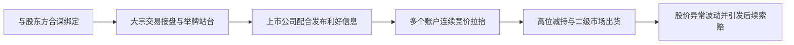
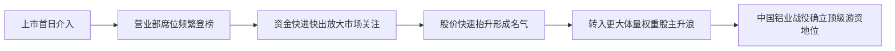
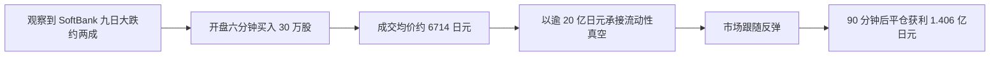
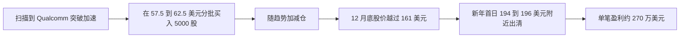

# 国内外知名游资大佬研究报告（1）

## 执行摘要

本报告最终只纳入 **4 位代表人物**，其中国内 **2 位**、国外 **2 位**，满足“国内外各半”的要求。之所以没有把名单扩到 6–8 位，不是因为市场上不够热闹，而是因为大量 A 股“游资别名”在 **实名、席位归属、历史业绩** 三个层面都存在核验障碍。2026 年 1 月《每日经济新闻》调查就披露，十余家券商 App 与第三方软件曾把未经权威核实的“游资标签”直接绑定到龙虎榜席位，随后又被删除或纠偏，这说明很多“江湖名号”并不适合直接当作高可信研究样本。基于这个现实，本报告采取“**少而硬**”的样本策略。 citeturn31search0turn31search11

如果按 **证据硬度** 看，国内样本明显更强。徐翔和章建平都能在证监会、法院、交易所文书，或至少主流财经媒体的长期跟踪中找到较完整的证据链；海外样本里，CIS 和 Dan Zanger 的“传奇性”同样很高，但更多依赖 Bloomberg、Fortune、行业媒体与本人披露的交易记录或税单核验，**不是监管审计口径**，因此可信度应视作“主流媒体可验证”而非“官方定论”。 citeturn37view1turn38view1turn38view0turn14view0turn14view1turn25view0turn39view1turn39view0

四位人物分别代表了四种很典型的短线/快钱范式：徐翔代表 **信息优势与资金优势叠加的复合操盘**；章建平代表 **大体量资金在题材与主升浪中的快进快出**；CIS 代表 **盘口失衡与流动性真空中的高强度日内博弈**；Dan Zanger 代表 **公开市场中高度纪律化的图形突破交易**。共同点是都极度依赖 **流动性、情绪和执行速度**；区别是国内案例更容易和 **股东减持、举牌、信息披露、监管边界** 纠缠在一起，而海外两例更多是在 **公开市场价格行为** 上做文章。 citeturn16view1turn16view2turn16view3turn32search6turn35view0turn36view0turn14view0turn14view1turn25view0turn39view1turn39view0

如果只问一句“谁最符合中文语境里的‘游资大佬’”，答案会偏向 **徐翔与章建平**；如果问“谁最像海外市场里的短线传奇样本”，则 **CIS 与 Dan Zanger** 更有代表性。但必须强调：**“海外游资”更像是中国语境下的类比概念，而不是监管定义上的一一对应**。 citeturn37view1turn35view0turn14view0turn25view0

## 样本筛选与信息分级

本报告采用三道门槛筛样本。第一，要有 **公开出处**，优先顺序是：监管文件、法院/交易所公告、上市公司公告、中文主流财经媒体、国际主流财经媒体、学术或行业资料；第二，要有 **市场热度**，即主流媒体长期追踪，或在交易社群中形成稳定话题；第三，要有 **实力证据**，要么有明示业绩，要么有可量化的代表操盘案例，要么有持续的资金影响力。 citeturn38view1turn38view0turn37view1turn32search2turn14view0turn25view0

在 A 股语境中，最难的是“**人物—营业部—业绩**”的归因问题。近年舆论里非常热门的游资别名并不少，但很多材料来自论坛帖子、同花顺/东方财富/券商 App 标签、二次转载，缺少官方直接确认。2026 年 1 月每经调查披露，多家券商和第三方平台曾将坊间传闻包装成近似“确权”的龙虎榜游资标签，这正是本报告压缩样本数量的核心原因。 citeturn31search0turn31search11turn31search3

本报告的信息分级如下：**A级** 为证监会、法院、交易所、上市公司公告；**B级** 为财新、财联社、证券时报、央广、中国证券报、Bloomberg、Fortune、TIME 等主流媒体；**C级** 为交易行业媒体、人物自述、留存页、论坛或社群转述。C 级资料只作为补充，不单独支撑关键结论。 citeturn38view1turn38view0turn32search2turn37view1turn35view0turn14view0turn25view0turn39view1

## 人物对比表

| 姓名/绰号 | 地区 | 代表案例 | 主要出处 | 争议/处罚 | 实力指标 |
|---|---|---|---|---|---|
| 徐翔 / 私募一哥 | 中国内地 | 文峰股份 2014–2015：合谋减持、利好配合、16 账户竞价拉抬 | 财新；上交所法治文集；法院/文峰股份后续公告 | 2017 年操纵证券市场罪一审获刑；后续民事索赔持续扩大 | 泽熙 2015 年前三季度平均收益 217.54%；文峰案获利 4.54 亿元；13 股违法所得 93.37 亿元 |
| 章建平 / 章盟主 | 中国内地 | 北辰实业 2006；中国铝业 2007；寒武纪 2024–2026 显示当下资金体量 | 证监会处罚书；上海证监局警示函；财联社；证券时报 | 2019 年海利生物警示函；2024 年借用证券账户被顶格罚 50 万元 | 北辰实业约 3 个月股价 2.37→8.91；寒武纪持仓市值约 35.13 亿→92.38 亿元 |
| CIS | 日本 | SoftBank 2014：90 分钟反弹交易；J-Com 2005；Nikkei 2015 暴跌反手 | Bloomberg/《华盛顿邮报》；TIME/Fortune | 真实姓名未公开；总财富与全周期收益并非全部可核验 | 2013 年税后收益 60 亿日元；2013 年交易额 1.7 万亿日元；SoftBank 单笔盈利 1.406 亿日元 |
| Dan Zanger | 美国 | Qualcomm 1999–2000 突破波段；CMGI 1999 | Fortune 留存页；STOCKS & COMMODITIES；Traders Magazine | 业绩核验主要靠税单/交易记录披露；2008 年出现合同诉讼争议 | 11,000 美元→1,800 万美元（18 个月）；23 个月达 4,200 万美元；QCOM 单笔约赚 270 万美元 |

上表信息主要依据证监会、法院、交易所、上市公司公告，以及财新、财联社、证券时报、Bloomberg/《华盛顿邮报》、TIME/Fortune 与专业交易媒体整理。 citeturn38view1turn38view0turn37view1turn16view1turn16view2turn16view3turn32search6turn35view0turn36view0turn14view0turn14view1turn25view0turn39view1turn39view0

## 代表人物条目

### 徐翔

**基本信息。** 徐翔常被媒体称为“私募一哥”，出身浙江宁波，早年在宁波短线圈崛起，后于 2009 年创建泽熙。财新留存资料写其出生于 1976 年 2 月 12 日，但部分公开报道也写 1977 年，因此其出生年份存在公开资料差异；这一点应标注为 **不确定/未完全核实**。 citeturn37view0turn20search5

**主要出处与链接。** 对徐翔最核心的公开证据链来自：财新关于其成长、泽熙业绩与定罪的长篇报道；最高人民法院把“徐翔操纵证券市场案”列为依法惩处证券犯罪的重要案例；以及上交所法治文集对其操盘模式的法证拆解。后续影响则可从文峰股份相关诉讼公告与主流财经媒体跟踪中看到。 citeturn37view1turn32search2turn32search8turn16view1turn16view2turn16view3turn27search8

**代表操盘案例。** 公开且最容易量化的样本，是 **文峰股份 2014 年 12 月至 2015 年 5 月**。根据后续民事判决所引刑事判决认定事实，徐翔与文峰股份时任董事长徐长江合谋：先约定减持与利润分配，再由徐翔用多个账户在二级市场连续买卖拉抬，同时配合发布股权转让、“高送转”等会影响价格的信息，最终徐长江高位套现，徐翔通过竞价交易和大宗交易获利约 4.54 亿元。同期文峰股份涨幅达 256.11%，明显偏离同期上证综指 44.29% 的涨幅。 citeturn32search6turn17search1turn26search5

下图按判决事实与法学文集整理了文峰股份案的典型流程。 citeturn16view1turn16view2turn16view3turn32search6

**量化快照。** 下表依据判决、报道和上市公司后续公告整理。 citeturn32search6turn17search1turn27search8

| 指标 | 数值 | 备注 |
|---|---:|---|
| 文峰股份区间涨幅 | 256.11% | 明显高于同期大盘 |
| 同期上证综指涨幅 | 44.29% | 用于对照 |
| 文峰股份期间换手率 | 345% | 报道称此前同时段为 115% |
| 徐翔在文峰案中获利 | 4.54 亿元 | 来源于后续民事判决援引的刑事事实 |
| 徐长江违法所得 | 34.08 亿元 | 含约定应分给徐翔部分 |
| 截至 2026 年初相关投资者诉讼 | 1,015 名、测算损失约 8,674.39 万元 | 余波仍在扩散 |

**影响力与争议。** 徐翔的影响力，不只来自“敢死队”时期的短线名气，更来自泽熙产品的超额收益。财新报道显示，徐翔被查当年，泽熙 2015 年前三季度平均收益仍达 217.54%，远超第二名；财新专题还提到，泽熙 1 号和 3 号投资收益都超过 30 倍。另一方面，他在 2017 年因操纵证券市场罪一审被判有期徒刑五年六个月，并处罚金；最高法后续多次把徐翔案作为重大证券犯罪案例提及。 citeturn37view1turn37view2turn32search2turn32search8

**不确定/未核实项。** 徐翔出生年份在不同公开材料中出现 1976 与 1977 两种写法；此外，部分关于其刑事罚金、分股逐笔明细的数字，在当前可公开直接检索到的材料里更多来自法学文集转述与后续民事诉讼材料，而不是完整公开的一审判决全文，因此在严格证据学上应视作 **次一级公开证据**。 citeturn37view0turn20search5turn16view1turn16view2turn16view3

### 章建平

**基本信息。** 章建平，市场更熟悉其绰号“章盟主”。证监会 2024 年行政处罚决定书直接确认其基本身份：男，1966 年 4 月出生，住址在浙江杭州；这使他在一众 A 股游资别名里，属于少数 **实名和监管文书能对上号** 的人物。主流媒体普遍回溯其 1996 年以 5 万元入市、此后逐步做大的经历。 citeturn38view1turn35view0turn35view1

**主要出处与链接。** 对章建平的高可信出处主要有三类：第一，证监会 2024 年《行政处罚决定书（章建平、方德基）》；第二，上海证监局 2019 年关于海利生物的警示函；第三，财联社与证券时报对其历史战役和近期持仓的连续报道。 citeturn38view1turn38view0turn35view0turn36view0

**代表操盘案例。** 如果要选最像“经典游资”的公开样本，我更倾向于 **北辰实业 2006**。财联社梳理称，北辰实业上市当天章建平就在东吴证券湖墅南路席位买入；从上市到 12 月 6 日的约三个月里，其席位 14 次登上龙虎榜，累计买入 2.5 亿元、卖出 2 亿元，期间股价从 2.37 元涨至 8.91 元，接近三倍。此后他又快速转战招商轮船，并在 2007 年中国铝业一役中完成“封神”。财联社称，中国铝业 2007 年 10 月涨到 60.6 元，较发行价翻约 10 倍，市场估算章建平至少赚取上亿元。 citeturn35view0turn35view1

下图按公开媒体复盘其“北辰实业—中国铝业”这一阶段的典型打法。需要说明的是，这一流程依据主流财经媒体整理，而不是交易所逐笔流水。 citeturn35view0turn35view1

**量化快照。** 下表把“历史短线战役”和“当下资金体量”放在一起看，更能理解章建平为什么长期被视作大游资。 citeturn35view0turn35view1turn36view0turn38view1turn38view0

| 指标 | 数值 | 备注 |
|---|---:|---|
| 北辰实业股价 | 2.37 → 8.91 元 | 约三个月近 3 倍 |
| 北辰实业龙虎榜活跃度 | 14 次上榜 | 累计买入 2.5 亿元、卖出 2 亿元 |
| 中国铝业历史高点样本 | 60.6 元 | 财联社称较发行价约 10 倍 |
| 寒武纪持仓市值 | 35.13 亿元 → 92.38 亿元 | 2024 年末到 2025 年末 |
| 寒武纪持股数 | 533.88 万股 → 681.49 万股 | 同期持续加仓 |
| 2024 年借用账户处罚 | 50 万元 | 对章建平为顶格罚款 |

**影响力与争议。** 章建平的强项，不只是会打热点，更是 **资金体量极大**。证券时报披露，他在寒武纪上的持仓市值从 2024 年末的约 35.13 亿元增至 2025 年末的约 92.38 亿元，2026 年一季度才退出前十大股东名单。这说明他并不是“只会打小票的席位型游资”，而是仍能对大市值热门股形成实质影响。与此同时，他也踩过监管红线：2019 年，上海证监局认定其与一致行动人在持有海利生物达到 5% 后继续增持 5.37%，对其出具警示函；2024 年，证监会又认定其在 2020 年 3 月至 2023 年 10 月借用岳父账户从事交易，对其处以 50 万元罚款。 citeturn36view0turn38view0turn38view1

**不确定/未核实项。** 章建平历史上最著名的北辰实业、中国铝业盈利数字，当前主要来自主流媒体长期复盘与市场估算，并非官方披露的完整交易对账单。因此，“赚取上亿元”这一表述应理解为 **媒体估算**。另外，历史上部分“常用席位”与其个人的绑定，也主要是媒体和市场长期跟踪形成的共识，不等于交易所逐笔确权。 citeturn35view0turn35view1turn31search0turn31search11

### CIS

**基本信息。** CIS 是日本最著名的匿名日内交易者之一。《华盛顿邮报》转载的 Bloomberg Market Magazine 报道把他描述为“能穿着睡衣在卧室里让市场动起来的人”，并明确写到：只有极少数同行知道他的真实姓名，他没有提供完整的收益总账，且其部分说法 **无法完全核验**。这意味着，CIS 是一个高度著名、但同时也必须接受“匿名与核验边界”约束的人物。 citeturn14view0

**主要出处与链接。** 关于 CIS，最核心的公开来源是 Bloomberg 的人物长文留存页，以及 TIME/Fortune 对其 2015 年全球股灾交易的转述；这两类材料的价值在于，它们既有市场热度，也提供了具体订单、时点和盈亏数字。 citeturn14view0turn14view1

**代表操盘案例。** 如果挑一个最能体现其风格的经典样本，我会选 **2014 年 2 月 4 日 SoftBank 反弹交易**。Bloomberg 长文写道，SoftBank 在此前九个交易日已跌去约五分之一，在 2 月 4 日开盘后六分钟，CIS 以 6,714 日元买入 30 万股，金额略高于 20 亿日元；随后市场其他买盘跟进，SoftBank 最终成为当天日经 225 成分股中仅有的两只上涨股之一。90 分钟后，CIS 平仓，获利 1.406 亿日元。报道还提到，他的“第一桶大声名”来自 2005 年 Mizuho 在 J-Com 上的错单事件：他称自己买入 3,300 股，赚了 6 亿日元。 citeturn14view0

下图按 Bloomberg 报道整理了 2014 年 SoftBank 这笔交易的节奏。 citeturn14view0

**量化快照。** 下表把 CIS 的公开“硬数字”集中列出。 citeturn14view0turn14view1

| 指标 | 数值 | 备注 |
|---|---:|---|
| SoftBank 当日买入规模 | 30 万股、约 20 亿日元 | 2014-02-04 开盘后六分钟 |
| SoftBank 90 分钟利润 | 1.406 亿日元 | 当日反转交易 |
| 2005 年 J-Com 错单样本 | 3,300 股、约赚 6 亿日元 | 其“第一笔大声名” |
| 2013 年税后收益 | 60 亿日元 | Bloomberg 采访口径 |
| 2013 年股票交易额 | 1.7 万亿日元 | 日本个人交易额的约 0.5% |
| 最忙一天交易额 | 700 亿日元 | Bloomberg 采访口径 |
| 2015 年全球股灾交易 | 约赚 3,400 万美元 | 先空日经期货再反手做多 |

**影响力与争议。** CIS 的影响力首先来自交易量。Bloomberg 报道说，他 2013 年股票交易额达到 1.7 万亿日元，最忙的一天买卖额 700 亿日元；他自称税后盈利 60 亿日元、总财富超过 160 亿日元。其次来自他在极端行情中的应变：TIME/Fortune 援引 Bloomberg 称，他在 2015 年全球市场恐慌中通过做空日经 225 期货并在恐慌尾声反手，单周赚了约 3,400 万美元。争议点也很清楚：他的匿名身份、完整账本不公开，以及部分财富声称无法被第三方完全验证。 citeturn14view0turn14view1

**不确定/未核实项。** 真实姓名未公开；总财富和全周期累计收益并无完整公开审计口径；外部世界能看到的是 **局部账户证明、税表样本与媒体访谈**。因此，CIS 更适合作为“日本短线传奇样本”，而不是“官方绩效样本”。 citeturn14view0

### Dan Zanger

**基本信息。** Dan Zanger 是美国最著名的图形突破型短线传奇之一。Fortune 2000 年的报道把他写成“前泳池承包商”，并称其把 11,000 美元做到了 1,800 万美元；后续《STOCKS & COMMODITIES》采访补充说，23 个月时总规模增长到 4,200 万美元。2010 年《Traders Magazine》又把他描述为 Westwood Capital 的动量交易者，偏好流动性好的大盘股。 citeturn25view0turn39view1turn39view0

**主要出处与链接。** 研究 Dan Zanger 时，最重要的不是“有没有很多人在讲”，而是“谁核验过”。本次检索中，最核心的三份材料分别是：Fortune 2000 年人物报道的留存页；《STOCKS & COMMODITIES》2003 年采访；《Traders Magazine》2010 年关于其对冲基金风格的报道。争议材料则来自 2008 年合同诉讼裁定。 citeturn25view0turn39view1turn39view0turn23view0

**代表操盘案例。** Fortune 报道里最典型的一笔，是 **Qualcomm 1999 年末到 2000 年初**。Dan Zanger 观察到股价“开始变得活跃”，随后在拆股调整后的 57.5 美元到 62.5 美元区间分批买入 5,000 股。几周后，股价最高到 93 美元，但波动很大；他在震荡中边拿边调，到了 12 月 30 日已跃过 161 美元，新年首个交易日再上冲后，他在 196 美元和 194 美元附近把剩余仓位全部清掉，单笔盈利约 270 万美元。 citeturn25view0

下图按 Fortune 文章整理了这笔 Qualcomm 交易的基本逻辑。 citeturn25view0

**量化快照。** 下表集中体现他的“传奇度”与“可核验边界”。 citeturn25view0turn39view1turn39view0turn22search1

| 指标 | 数值 | 备注 |
|---|---:|---|
| 账户增长 | 11,000 美元 → 1,800 万美元 | Fortune 披露为 18 个月 |
| 延伸增长 | 4,200 万美元 | 23 个月，见 2003 行业采访 |
| 1999 年税表资本利得 | 14,232,878 美元 | Fortune 写明曾核对税单与交易记录 |
| Qualcomm 单笔利润 | 约 270 万美元 | 1999 末至 2000 初 |
| CMGI 另一个样本 | 4 天超 210% | 行业媒体摘要 |
| 典型持仓周期 | 4 天到 2 周，不超过 30 天 | 2010 年《Traders Magazine》 |

**影响力与争议。** Dan Zanger 的影响力在于，他把“公开市场图形交易”推到了近乎神话的高度。《STOCKS & COMMODITIES》采访称，他不用传统指标，核心只看 **图形、价格、成交量**；《Traders Magazine》则披露，他在 2010 年管理一个约 4,000 万美元的对冲基金，通常持股 4 天到 2 周，且更重视流动性与确定性，而不是几毛钱的成交价差。争议则主要有两类：第一，他的“传奇收益”虽然有 Fortune 根据税单和交易记录做过核验，但仍属于 **媒体核验** 而非监管口径；第二，2008 年 Independent Asset Management 与其合同诉讼中，原告称其激进波动交易引发上百次保证金追缴，法院允许 IAM 的部分索赔主张继续推进。 citeturn39view1turn39view0turn25view0turn23view0

**不确定/未核实项。** “23 个月到 4,200 万美元”并不在 Fortune 原始人物报道里，而是出现在后续行业采访中；此外，Dan Zanger 整个职业生涯的完整收益曲线并无公开监管审计文件，因此其传奇表现应视为“**高热度、可追溯、但非官方审计型**”证据。 citeturn25view0turn39view1

## 横向比较与结论

如果把四人放在同一张坐标系里看，**徐翔** 的“证据硬度”最高，因为他同时具备刑事判决、最高法典型案例地位、交易所法学拆解和上市公司后续索赔链条；**章建平** 次之，核心在于有证监会和地方证监局两份正式文书能稳稳落地，再加上近年的大额持仓披露；**CIS** 和 **Dan Zanger** 都很著名，但其强项是“市场传奇性”和主流媒体样本级核验，不是官方处罚或官方审计。 citeturn37view1turn32search2turn16view1turn16view2turn16view3turn38view1turn38view0turn14view0turn25view0turn39view1

如果按“操盘范式”来分，四人几乎代表了四个不同物种。徐翔是 **信息与资金结合** 的复合操盘样本，本质不是单纯打板，而是能够把股东减持、公司信息与二级市场交易动作串起来；章建平是 **大资金版题材和主升浪交易者**，更像“能打情绪，也能顶大票”；CIS 是 **市场微结构型高手**，擅长在价格错位与情绪极值里抢流动性；Dan Zanger 则是 **图形突破派的极致版本**，把公开 tape reading 和量价结构做到了高度纪律化。 citeturn16view1turn16view2turn16view3turn35view0turn36view0turn14view0turn25view0turn39view1turn39view0

如果只站在中国投资者的语感里，“**最像游资大佬**”的仍是徐翔与章建平；如果要做国际类比，CIS 更接近日内超短与流动性狙击手，Dan Zanger 更接近高成功率的波段突破交易明星。换句话说，国外并不存在一个和 A 股“龙虎榜游资文化”完全等价的生态，所以本报告的海外部分更准确地说是“**短线快钱传奇操盘手**”样本，而不是照搬中文圈定义。 citeturn31search0turn31search11turn14view0turn25view0

最终结论很直接：
在 **“有公开出处 + 有热度 + 有实力证据”** 这三条同时成立的前提下，徐翔、章建平、CIS、Dan Zanger 是一组相对稳妥且具有代表性的国内外对照样本。若继续扩样到更多 A 股别名游资，研究热度会更高，但证据质量会明显下降。对真正做深度研究的人来说，**宁可少样本，也不要把未经核实的“席位神话”当事实**。 citeturn31search0turn31search11turn37view1turn38view1turn14view0turn25view0

## 研究方法与参考来源

本报告的检索截止到 **2026 年 6 月 11 日**。方法上，先以官方监管、法院、交易所、上市公司公告为主轴，再用财新、财联社、证券时报、央广、Bloomberg、Fortune、TIME 等主流报道做人物与案例补全；对行业媒体、留存页、人物自述，只在能补足关键交易细节且与主流来源不冲突的情况下使用。对于无法完整核验的内容，一律在人物条目内标注“**不确定/未核实**”。 citeturn38view1turn38view0turn32search2turn37view1turn35view0turn14view0turn25view0turn39view1

本报告同时参考了 2026 年关于“龙虎榜游资标签化”的媒体调查，用来约束样本选择，避免把市场传闻直接写成事实。也因此，报告没有把大量只活跃于论坛、终端标签和二次转载中的别名游资纳入主样本。 citeturn31search0turn31search11

**核心参考来源清单如下：**

- 中国证监会《行政处罚决定书（章建平、方德基）》〔2024〕51 号。 citeturn38view1
- 上海证监局《关于对章建平、方文艳、方德基采取出具警示函措施的决定》。 citeturn38view0
- 财新《徐翔：神话的结束》与《徐翔案落幕“股神”褪色》。 citeturn37view0turn37view1
- 最高人民法院有关依法惩处证券犯罪的发布材料。 citeturn32search2turn32search8
- 上交所法治文集《徐翔操纵市场案中的法律与证据问题探微》。 citeturn16view1turn16view2turn16view3
- 证券时报关于文峰股份投资者索赔进展的报道与公司公告跟踪。 citeturn26search4turn27search8
- 财联社《连续多日网传“知名牛散章建平跑路”，证实来了》与《超级牛散章建平借账户炒股遭顶格罚》。 citeturn35view0turn35view1
- 证券时报《章建平，突变！发生了什么？》。 citeturn36view0
- Bloomberg Market Magazine 人物报道留存页《Meet CIS, Japan’s market-moving enigma…》。 citeturn14view0
- TIME/Fortune《A Japanese Day Trader Made $34 Million In the Market This Week》。 citeturn14view1
- Fortune 留存页《My Stocks Are Up 10,000%! Dan Zanger》。 citeturn25view0
- 《STOCKS & COMMODITIES》采访《The Charts Know It All: Dan Zanger》。 citeturn39view1
- 《Traders Magazine》报道《Trading’s Ins and Outs》。 citeturn39view0
- 美国法院合同纠纷裁定 *Independent Asset Management LLC v. Zanger*。 citeturn23view0

（2）

全球资本市场顶级游资大佬深度研究报告：策略演变、微观结构解析与财富跃升路径核心摘要与引言在现代全球资本市场的生态系统中，“游资”（Speculative Capital 或 Hot Money）始终扮演着价格发现的催化剂与流动性供给者的双重角色。有别于以资产配置为主导的公募基金、主权财富基金或大型量化机构，游资往往由极具交易天赋和执行力的个人投资者或小型私募主导。他们通过对市场微观结构（Market Microstructure）、群体心理学（Behavioral Finance）以及特定监管规则的深刻理解，在极短的时间内实现了资产的几何级数跃升。本报告旨在对国内外最具代表性、最具实力与市场热度的“游资大佬”进行详尽的学术与实务分析。通过解构中国A股市场的涨停板敢死队及新生代游资、日本高频交易市场的乌龙指套利者、美国期权与迷因股（Meme Stock）市场的引爆者，以及东南亚传统经纪市场的跨界巨头，本报告系统性地揭示了不同监管环境与交易机制下，游资策略的演化路径及其深远的金融学意义。研究对象不仅涵盖了中国A股第一代至新生代的标志性人物（如徐翔、章建平、赵老哥、炒股养家、陈小群、方新侠等），还深入剖析了日本市场利用规则漏洞一战成名的B.N.F与CIS，美国市场引发史诗级散户逼空的Keith Gill（Roaring Kitty），以及新加坡从股票经纪人蜕变为商业财阀的林荣福（Peter Lim）。通过对这些顶级游资的经典战役与资金规模的解构，本报告为理解全球投机资本的底层逻辑提供了极其稀缺的实证视角。第一章：中国A股游资江湖——从草莽时代的野蛮生长到量化博弈下的生态重构中国A股市场的T+1交收制度与10%的涨跌幅限制，孕育了全球独一无二的“涨停板生态”（Limit-Up Ecosystem）。涨跌幅限制本质上是对流动性的一种人为阻断，而A股游资的核心商业模式，正是利用这种阻断造成的“流动性溢价”与“情绪极致溢价”进行跨期套利。A股游资的发展经历了从早期地域性营业部聚集的“敢死队”模式，到互联网论坛时代的“游资席位化”与“心法体系化”，再到如今在量化资本（Quants）高频镰刀下艰难突围的新生代游资演变。1.1 第一代游资图腾与覆灭：宁波涨停板敢死队与徐翔的兴衰史受到甬商精神中敢于冒险、勇为人先等核心内涵的影响，浓厚的商业氛围和充裕的民间资本在浙江宁波培养了特殊的游资文化。上世纪90年代后期，以银河证券宁波解放南路营业部为核心，聚集了约20名风格极其彪悍的短线交易者，被市场广泛冠以“宁波涨停板敢死队”的称号。在这一群体中，最著名的核心人物即为后来的“私募一哥”徐翔。在解放南路时期，徐翔被当地股民亲切地称为“强强”（因宁波方言中“翔”与“强”同音），其年少轻狂但深谙交易之道，时常无偿指点长辈操作账户。据业内人士估计，徐翔在宁波蛰伏的十年间，至少积累了20亿元人民币的原始财富。徐翔及其团队的核心策略体现为大进大出、高起高落的涨停板战法。当某只股票被选定为目标时，敢死队会利用庞大的资金优势，在涨停价位挂出巨量买单封死涨停，迫使次日市场情绪发酵，散户跟风追涨，从而在次日高开时从容获利了结。2003年2月15日，《中国证券报》在头版刊发《涨停板敢死队》一文，正式将宁波解放南路的天一证券和银河证券营业部推向全国投资者的视野，让这一群体声名鹊起。随着资金体量的不断膨胀，徐翔于2006年离开宁波前往上海，并在2009年12月低调创立了注册资本3000万元的上海泽熙投资管理有限公司，标志着其正式从个人游资向阳光私募机构转型。为掩护其庞大的资金运作，徐翔使用了包括其母亲郑素贞在内的大量关联账户（马甲）进行交易。然而，游资出身的徐翔在规模极度膨胀后，其操作手法最终触碰了监管红线。2015年11月1日，身穿白色休闲西装的徐翔在杭州湾跨海大桥上被警方采取强制措施，一代枭雄就此落幕。2017年1月，青岛中院一审判决其操纵证券市场罪名成立，判处有期徒刑5年6个月，没收违法所得逾90亿元，并处罚金110亿元。该案引发的连锁反应极其深远，案发后徐翔家庭名下被查封的资产一度高达210亿元人民币，其中包括120亿信托现金及多家上市公司股权。即使徐翔已于2021年7月刑满释放，但其庞大的资产甄别、巨额罚金的缴纳，乃至其妻应莹在监狱内提出的离婚诉讼及后续的财产分割（涉及宁波中百、大恒科技等上市公司实控权的潜在变更），至今仍是资本市场高度关注的合规警示案例。1.2 超级牛散的百倍神话与合规悬剑：章建平（章盟主）与徐翔同时代的另一位标志性游资大佬是被称为“中国牛散第一人”及“章盟主”的章建平。章建平1966年出生于浙江杭州临安，早年毕业于天津商学院，被分配到杭州解放路百货商店从事家电销售业务，后辞职回老家经营复印机维修生意。1996年，章建平将仅有的5万元人民币投入股市，至1997年便将资金翻倍至20万元，从而开启了其波澜壮阔的资本生涯。章建平的操作风格倾向于顺势而为，极度偏好大盘蓝筹与次新股的波段操作。其封神之战发生在2007年，当时中国铝业登陆A股市场，股价从6.6元的发行价一路飙升至60元的高峰。章建平重仓介入中国铝业，名利双收。在2007年大牛市极盛时期，其个人资产据传已达到近20亿元人民币，全年股票成交金额高达700亿元，日均成交2.8亿元，仅缴纳的印花税就接近2亿元，被市场尊称为民间股神。甚至在杭州大金球附近，其斥资15亿元建设了一幢大楼。由于交易行为极其活跃，其曾被沪深交易所定性为“疯狂的投资者”，深交所曾对其进行高频度的电话警告。在投资哲学上，章建平极度强调情绪管理与趋势跟随。其经典语录指出，在一个上升通道中赚钱是必然的，亏钱则是由于投资者的心态问题；他同时强调，缺乏耐心将在股市一无所获，而不会空仓的交易者永远无法真正学会战斗。近年来，章建平家族依然活跃在A股市场，例如在2024年一季度，其新进成为寒武纪的前十大流通股东，持股数量达608.63万股，期末参考市值高达37.92亿元；同时他还大举布局了算力服务企业海南华铁，持股总市值达8.99亿元。然而，游资的操作模式始终面临合规边界的考验。2024年8月，证监会披露了一份顶格罚单，指出章建平在2020年至2023年期间借用其岳父方德基的证券账户进行交易，违反了《证券法》第五十八条的规定。证监会据此对章建平与出借账户的方德基双双处以50万元人民币的顶格罚款，这不仅凸显了监管层对实名制与账户借用行为的零容忍态度，也反映了传统游资在现代强监管语境下的生存困境。1.3 “八年一万倍”的杠杆传奇：赵老哥（赵强）与互联网游资文化的兴起随着互联网论坛（如淘股吧）的兴起，第二代游资开始公开交割单，形成了极具影响力的“游资文化”。其中最具代表性的人物是出生于1987年的赵强，网名“赵老哥”。毕业于杭州某财经大学的赵强，在2007年以父母提供的10万元本金起步，至2015年4月，其资金规模成功突破10亿元级别，实现了惊世骇俗的“八年一万倍”战绩。赵强的成功并非纯粹的运气，而是建立在极端的市场情绪捕捉与券商融资杠杆的深度绑定之上。据券商人士透露，游资与证券营业部的关系极为紧密，赵强通过融资操作获得了远超普通投资者的资金杠杆。在2015年的大牛市中，凭借对中国中铁、暴风科技等超级强势股的精准踩点与接力操作，其资产实现了几何级爆发。作为85后游资的代表，赵强在网络上极为高调，其身上贴满了法拉利跑车、红酒以及千万级豪华婚礼等标签，他甚至曾在网络上感叹“女人比股票复杂”。然而，市场环境的恶化也会让顶级游资感到无奈，2016年其在操作“深深宝”时遭遇恶劣走势，甚至在网络上公开发文抱怨砸盘行为，展现了游资在极端博弈中的真实心理状态。1.4 情绪周期理论的宗师：炒股养家与游资心法体系如果说赵老哥代表了游资操作手法的凶悍与高调，那么网名“炒股养家”的游资大佬则以其深刻的理论总结闻名于世，其所撰写的“养家心法”成为了无数短线交易者的启蒙教材。养家流派将短线交易从单纯的“技术图形分析”升维到了“行为金融学”与“微观群体心理学”的范畴。炒股养家明确提出“股票操作是科学”，其理论体系的核心思想是基于对市场情绪的揣摩，进而判断风险和收益的比较，并指导实际操作。其心法总纲指出：“高手买入龙头，超级高手卖出龙头；别人贪婪时我更贪婪，别人恐慌时我更恐慌；敢于大盘低位空仓，敢于大盘高位满仓；心中无顶底，操作自随心。”在具体的战术执行上，炒股养家强调根据市场的赚钱效应和恐慌效应来判断大势。在有赚钱效应的环境下，主攻强势热点股；在恐慌效应蔓延时，则重点寻找超跌反弹的机会，特别是当大盘连续下跌后出现大阴线、指数远离5日均线时，便是超跌反弹的绝佳出击时刻。在仓位管理上，他主张风险收益比是决定仓位的唯一因素，没有好机会就耐心持有现金。这种高度系统化的操作哲学，使得“炒股养家”成为游资界的一代宗师。1.5 新生代游资的突围：在量化围猎中杀出的极致纪律近年来，随着A股市场生态的剧变，特别是量化高频交易（Quant）的全面介入，传统的打板策略面临严峻挑战。量化算法通过高频嗅探与融券做空，精准收割传统游资的突破形态。在这一背景下，新生代游资被迫进化出更极致的执行力与更复杂的交易体系。陈小群：军人底色的极致纪律与慈善情怀
出生于1995年的北京青年陈小群，是新生代游资中最耀眼的新星。其在大学二年级时做出惊人决定，休学入伍当兵。在部队的两年里，他每天凌晨起床训练，深夜借着路灯学习股票理论，将军人的纪律性深深刻进骨子里。2017年退伍后，他潜心研究股市，2018年以30万元本金正式入市，期间经历过爆仓与迷茫，最终耗时5年形成自己的交易模式。面对量化横行的市场，陈小群深刻认识到散户被收割的根源在于“无纪律、跟风追涨”。他构建了极简投资体系，强调“股市做大的核心密码是合力与纪律”。其操作风格以“情绪周期+龙头战法+极致纪律”为核心，擅长通过分时弱转强、涨停突破等信号重仓介入市场总龙头。在2024至2025年期间，他在龙虎榜的成交额高达360亿元，重仓操作了航天电子、永辉超市、鲁信创投、通宇通讯等标的，资产规模迅速突破10亿元级别。2025年8月与2026年1月，他两度在朋友圈展示其“一年三个月收益20倍”的惊人战绩。与众多隐匿财富的游资不同，陈小群在实现财务自由后，清空了抖音等社交媒体内容，选择“绝对静默”，并在2026年1月向中国青少年发展基金会捐赠1000万元人民币用于建设希望小学，展现了新生代游资深厚的社会责任感与宏大格局。方新侠与小鳄鱼：大成交量趋势与波段反包的王者
方新侠作为与赵老哥同期的顶级游资，以操作手法大开大合著称。他拥有庞大的资金实力，偏好介入总市值在200亿以上的标的，专注于大成交趋势股。其真正声名鹊起的战役是2020年的“省广之战”。在2020年5月，方新侠连续大手笔买入省广集团，并在随后的21个交易日内14次登上龙虎榜。他运用高超的锁仓做T策略，累计买入8.94亿元，卖出10亿元，最终在股价最高点附近精准逃顶，单只股票净赚逾1亿元，确立了其在游资圈的顶级地位。被誉为90后游资领军人物的“小鳄鱼”，则于2011年以数万元资金入市，在2015年的大牛市助力下成功破亿。小鳄鱼的手法剽悍，资金实力极其雄厚，波段操作胜率极高。其核心战法包括“强势股反包模式”与“连板接力”，例如在复旦复华与中国出版的操作中，均展现了极强的日内波段盈利能力。近期，小鳄鱼豪掷2.73亿元重仓押注第一创业，再次验证了其主导市场风向的庞大体量。另类游资：乔帮主的低吸模式与呼家楼的凶悍洗盘
区别于传统的打板客，拥有北大IT研究生学历的80后游资“乔帮主”开创了独特的“低吸模式”。他极少在涨停板排单追高，而是偏好在强势股分时图大幅回撤（甚至跌停附近）时大举吸筹，或者专注于“下午板”的强势拉升。这种策略巧妙地避开了早盘量化资金的高频博弈，反映了游资策略的多样化演进。而另一路顶级游资“呼家楼”，则以大额卖出与出清见长。例如在科技股润和软件出现20CM跌停的极端行情中，呼家楼的两大常用席位单日合计卖出高达4.9亿元，展现了游资在情绪退潮期的冷酷与果决。1.6 中国A股游资核心席位与策略数据微观汇总以下表格系统性整理了A股顶级游资的活跃席位、核心策略及其标志性战役，为洞察A股微观结构提供了重要参考。游资大佬/流派常用关联营业部（龙虎榜核心席位）交易策略底层逻辑与风格特征资金爆发节点与标志性战役章建平 (章盟主)国泰君安上海江苏路、中信证券杭州延安路、国泰君安宁波彩虹北路顺势而为，偏好大盘蓝筹与次新股的大级别接力操作1996年5万起家，2007年中国铝业战役身价近20亿赵强 (赵老哥)银河证券绍兴营业部、中信证券淮海中路、浙商证券绍兴分公司极致的高杠杆操作，热点龙头股的强势连板接力2007-2015年操作中国中铁等，实现八年一万倍至10亿炒股养家华鑫证券上海红宝石路、华鑫证券上海茅台路、华鑫证券宛平南路基于行为心理学的“养家心法”，主攻龙头股与极端超跌反弹构建了游资圈广泛认可且极具系统性的情绪周期理论陈小群中国银河证券大连黄河路情绪周期合力，极致纪律对抗量化收割，分时弱转强30万起家，2025年重仓航天电子等，15个月20倍至10亿方新侠兴业证券陕西分公司、中信证券西安朱雀大街大资金引导大容量（200亿以上市值）趋势股，锁仓做T2020年主导省广集团大二波，累计买卖超18亿，赚逾1亿小鳄鱼南京证券南京大钟亭等强势股反包模式，重磅波段操作与极高的短线胜率2011年入市，2015年破亿，近期单笔超2.7亿买入第一创业乔帮主招商证券深圳蛇口工业七路、招商证券北京金融大街拒绝早盘追涨，专注于大跌低吸模式与下午板的强势拉升12万起步，避开传统打板内卷，资产达数亿元中信古北路 (传孙哥)中信证券上海古北路专注于上市初期次新股与热点题材强势股的轮番拉抬短期异军突起，与中投无锡清扬路等江浙沪游资高度协同华泰深圳荣超华泰证券深圳益田路荣超商务中心游资界的“少林寺”，资金雄厚、技术全面，主打名家汇等2016年龙虎榜实力排名第一，传闻为游资牛人徐留胜所在地呼家楼中信建投北京朝外大街、中信证券北京总部短线题材爆发点的极致炒作，大额果断出清与止损近期主导润和软件等高波动科技股，单日抛售近5亿元第二章：日本高频交易的封神榜——极致微观套利与“乌龙指”奇迹与中国A股市场的T+1交收机制和严苛的涨跌幅限制不同，日本股市实施T+0（当日回转交易）且涨跌幅限制极为宽泛，这为极高频的日内交易（Day Trading）提供了肥沃的土壤。在这一截然不同的微观结构下，诞生了全球最著名的两位散户游资——B.N.F与CIS。两人的封神之战，均源于世界证券史上罕见的规则漏洞与交易员失误引发的“乌龙指”事件。2.1 B.N.F (小手川隆)：七年一万倍的“J-COM男”与苦行僧式交易B.N.F，本名小手川隆，1978年出生于日本千叶县市川市。其网名B.N.F取自美国华尔街知名投资人维克多·尼德霍夫（Victor Niederhoffer）。小手川隆自学成才，凭借对实战经验的绝对依赖，在极短的时间内实现了财富的神话。到2001年底，其资产为6100万日元，至2004年底已经稳步上升至11亿日元。然而，真正让他载入史册并被媒体尊称为“J-COM男”（ジェイコム男）的，是2005年12月8日的“J-COM股交易失误事件”。J-COM乌龙指事件的套利机制：
当日，在新上市的J-COM股票交易中，日本瑞穗证券的交易员犯下了致命的输入错误，将原本“以61万日元售出1股”的指令，荒谬地错打为“以1日元售出61万股”。巨量且极度廉价的抛盘瞬间将股价砸至绝对低谷，引发股市大混乱。面对这一千载难逢的流动性黑洞，敏锐的B.N.F在仅仅10分钟内，动用庞大资金疯狂取得了7100股，并在同日于市场中迅速抛售1100股。随后，由于交易所发现重大异常并实施强制结算，B.N.F以每股91.2万日元的结算价卖掉剩余的6000股。这一惊心动魄的操作让他合计赚取了约20亿日元的利润，成为此次事件中获利最丰厚的个人投资者。微观交易体系与生活方式：
B.N.F的操作理念极其纯粹。他公开表示，自己从不看市盈率（P/E）或市净率（P/B）等基本面分析数据，因为他从不长期持有股票。他的交易手法属于高频当日冲销，每分每秒都在进行买卖。他高度关注大盘日经指数、期货指数变动、各国央行动向以及海外宏观指标，擅长利用“乖离率套利”（反SwingTrade）与“下跌时买进”策略，依靠洞察价格总体变动能力进行判断。凭借这种如同机器般精准的纪律，他仅用7年时间便让身价暴涨一万倍以上，一天内赚赔1至2亿日元成为常态。随着资金规模达到百亿级别，他开始感受到流动性受限的极大压力，并逐步将资金转移至Core30等大型股票乃至海外股票市场，甚至在2008年斥资约90亿日元买入东京秋叶原车站前的“チョムチョム秋叶原”商业大厦。令人惊叹的是，即使赚得盆满钵满，B.N.F依然保持着极其低调和简朴的生活。他出行乘坐公交车，日常饮食经常以泡面凑合，甚至不敢吃得太饱，因为“怕吃太饱了集中不了注意力”，这种近乎苦行僧般的专注力，正是其在瞬息万变的高频交易中立于不败之地的核心底层逻辑。2.2 CIS：推特上的“日本最牛散户”与社交媒体的市场影响力与B.N.F齐名的另一位日本游资大佬是化名为CIS的神级交易员。CIS出生于1979年左右，坊间传闻其曾是电竞冠军和弹球盘玩家，这种背景赋予了他极强的反应速度与博弈心态。自2000年在大学期间，CIS以300万日元（约2.6万美元）的微薄初始资金起家，开启了其波澜壮阔的交易生涯。在2005年的J-COM乌龙指事件中，CIS同样展现了惊人的手速和决断力，他迅速抢到了3300股，并因此爆赚6亿日元离场（虽然不及B.N.F的20亿日元，但依然是极其辉煌的战绩）。经过多年的高频博弈，CIS的个人身家已从最初的300万日元飙升至惊人的230亿日元（约2亿美元）。与极度低调、隐匿于世的B.N.F不同，CIS在社交媒体上极为活跃。他在推特（Twitter）上拥有超过27万粉丝，密切关注他对股市的任何看法。CIS被坊间誉为“呼风唤雨的rainmaker牛散”，号称其发布的一条推特就能直接左右日经指数的微观走势。这种将个人交易实力与社交媒体影响力深度结合的模式，预示了在全球互联网语境下，顶级游资已经从单纯的价格接受者，演变为了具备价格引导能力的意见领袖。他甚至出版了详述其交易秘笈的书籍，向公众分享其成功之道。第三章：美国迷因股的引爆者——期权杠杆、群蜂效应与Roaring Kitty的史诗级逼空相比中日市场游资主要依赖现货市场的“高频交易”与“打板接力”，美国市场的散户游资生态则呈现出截然不同的特征。高度发达的衍生品市场（尤其是短期期权）以及Reddit等社区论坛的普及，赋予了散户群体通过社交媒体形成“群蜂效应”（Swarm Behavior）并利用期权杠杆引发“伽马挤压”（Gamma Squeeze）的恐怖力量。在这一背景下，网名为 DeepFuckingValue (DFV) 兼 Roaring Kitty（咆哮的小猫）的 Keith Patrick Gill，成为了颠覆华尔街对冲基金的绝对领军人物。3.1 价值投资异变与GameStop史诗级逼空战役的发端Keith Patrick Gill 出生于1986年，原为美国马萨诸塞州万通寿险（MassMutual）的特许金融分析师和金融教育工作者。2019年中期，基于“深度价值”（Deep Value）投资理念，Gill 认定实体视频游戏零售商 GameStop (NYSE: GME) 的基本面被华尔街做空机构严重低估。他以约5.3万美元的初始资金建仓，并开始在 Reddit 的 r/wallstreetbets 论坛上以 DeepFuckingValue 的化名发布持仓截图和详尽的电子表格分析。随后，他以 Roaring Kitty 的身份在 YouTube 上开启直播。作为一个自称“书呆子”的交易员，他戴着标志性的红色头巾、穿着猫咪T恤，在地下室的直播中向散户布道，强调他“只是喜欢这只股票”。Gill 的坦诚与专业分析引发了散户群体的强烈共鸣，散户们不仅大量买入GME现货，更疯狂涌入看涨期权市场，展现出“钻石手”（Diamond Hands——即面对暴跌也坚定持有、绝不抛售的信念）。这种天量的期权买盘迫使期权做市商必须不断买入标的股票进行 Delta 对冲，进而引发了史无前例的“轧空”与“伽马挤压”。至2021年1月，Gill 的初始5.3万美元投资在狂热的市场情绪中暴涨至惊人的5000万美元。这场被好莱坞改编为电影《傻钱》（Dumb Money）的战役，不仅让参战的负债大学生获得了六位数的回报，也让 Gill 成为了散户心中的英雄。他甚至因此出席了美国国会众议院金融服务委员会的听证会，证明其并未进行内幕交易或恶意市场操纵。3.2 2024-2026年：基本面重构、资产动态估值与波段操作艺术2021年至2024年间，Gill 保持了极度低调，但他并未离开市场，而是在暗中大幅增持 GameStop。与早期纯粹的逼空逻辑不同，GameStop 自身的基本面在这几年间也发生了剧烈的重构。GameStop 的战略转型与基本面演变：
根据截至2025年10月的数据，面对全球超过60%的主机游戏销售转向纯数字版的行业趋势（例如2024年欧洲数字游戏销量增长15%，实体销量下降22%），GameStop 积极进行了战略调整。2024财年公司虽然净销售额降至38.23亿美元，但成功扭亏为盈，实现净利润1.313亿美元。更重要的是，公司积累了极其庞大的现金储备。截至2025年第二季度末，GameStop 持有高达87亿美元的现金、现金等价物及有价证券，且无债务负担。此外，在其CEO Ryan Cohen 的主导下，公司在2025年第二季度斥资约5.13亿美元购入4710枚比特币，探索混合零售与加密货币的全新商业模式，并向股东发行了行权价为32美元的认股权证（Warrants）。Roaring Kitty 的资产重估与波段财技：
在这一基本面支撑下，Gill 于2024年中期重返公众视野。公开监管文件与持仓截图揭示了其令人咋舌的财富规模：2024年6月的庞大底仓： 2024年6月13日，路透社报道确认 Gill 持有高达900.1万股的GME股票，且早前披露的12万份看涨期权已平仓。加上约630万美元的现金，其投资组合在当时的市场估值约为2.68亿美元。Chewy 的波段操作： 除了GME，Gill 还在2024年7月通过13G文件披露持有美国宠物电商 Chewy 6.6%的股份。然而，随后提交的修正文件（13G/A）及10月份的报道显示，他已彻底清仓了该笔头寸，持股比例降至0.0%。这充分展示了其在 Meme 股板块中敏锐且果决的波段操作能力，而非仅仅是死忠的长期持有者。2026年个人净值推算（Mark-to-Market Valuation）：
准确评估 Keith Gill 的净资产不能采用静态的明星财富排行榜模式，而必须采用“按市价计算”（Mark-to-Market）的动态模型。由于他持有极度集中的单一资产，GME 股价的日常波动即是其净值的直接驱动力。以2026年5月1日GME约26.53美元的股价计算，假设其900万股底仓未变，其股票头寸价值约为2.38亿美元。在此基数下，GME 股价每波动1美元，其净值就会随之产生约900万美元的剧烈震荡。评估节点GME 股票持有规模期权衍生品 / 现金储备预估投资组合总值 (Mark-to-Market)2019年中期初始建仓试探无显著现金~$53,000 初始投资2021年1月逼空高潮期大量看涨期权~$50,000,0002024年6月初5,000,000 股120,000 份看涨期权 ($20 行权价) + ~$2940万现金~$1.8亿+ (受盘中价格影响波动)2024年6月中9,001,000 股期权已平仓 / ~$630万现金~$2.68 亿 (股票占绝对主导)2026年5月 (预测模型)9,000,000 股 (假设未减持)历史现金数据作废，视作纯股票净值~$2.38 亿 (极度敏感于GME股价)值得注意的是，尽管2.38亿美元的净值使 Gill 稳稳跨入“超高净值人群”（Ultra-High-Net-Worth）的门槛，但他距离2025年《福布斯》美国400富豪榜高达38亿美元的入围门槛仍有极大差距，因此将其定义为“亿万富翁”在现阶段是不准确的。第四章：东南亚经纪巨鳄的阶层跃升——林荣福（Peter Lim）的实业化重构与中美日纯粹依靠二级市场价差获利、始终游走于交易屏幕前的游资不同，新加坡籍亿万富豪林荣福（Peter Lim）展示了游资及市场参与者演化的另一条终极路径：从利用佣金和客户网络获利的股票经纪人，彻底转型为掌控全球资产的实业资本家与体育产业巨头。他的生涯轨迹，完美诠释了资本从流通领域向生产与服务领域沉淀的最高形态。4.1 从“股票经纪王”到亿万富翁的原始积累林荣福的出身并不显赫。早年为了支付在西澳大利亚大学修读会计和金融学位的学费，他不得不从事厨师、服务员和出租车司机等繁杂的体力工作。1980年代，他投身于新加坡蓬勃发展的股票经纪行业。作为一名 Remisier（即仅依靠客户交易佣金获取收入的独立股票经纪人），林荣福凭借极强的人脉拓展能力与专业的市场判断，迅速建立起了庞大的客户网络。据《纽约时报》报道，他的核心客户群体甚至包括印度尼西亚前总统苏哈托之子，以及马来西亚前总理马哈蒂尔之子等东南亚顶尖政商名流。在为这些超级富豪提供交易服务的过程中，林荣福不仅赚取了数以百万计的巨额佣金，获得了新加坡“经纪王”（Remisier King）的美誉，更重要的是，他借此搭建了通往东南亚顶级资本圈的核心桥梁。1996年，已经完成巨额资本原始积累的林荣福果断退出经纪业务，正式转型为全职私人投资者。其投资生涯中最辉煌的长线战役，是上世纪90年代向印度尼西亚棕榈油企业（由马来西亚首富郭鹤年之侄郭孔丰联合创办的丰益国际 Wilmar）投资了1000万美元。这笔极具前瞻性的投资在随后的十几年间为其带来了惊人的回报，成为其跃升为全球亿万富豪榜单的关键资产锚点。4.2 跨国投资版图：医疗、体育与地产的地缘性整合在通过二级市场与早期股权投资获得巨大财富后，现年73岁、拥有约20亿美元净资产的林荣福，其投资版图已彻底脱离了短期的游资炒作，走向了深度的产业整合与全球化配置。他的投资逻辑从“价格博弈”转向了“资产运营与地缘红利收割”。1. 医疗大健康的区域扩张：
林荣福拥有新加坡主板上市的康生医疗集团（Thomson Medical Group），该公司是其控制的 Rowsley 公司在2017年以16亿新元收购医疗运营商后重组而成的。林荣福的医疗版图正迅速向东南亚扩张。2025年8月，该集团宣布在马来西亚柔佛-新加坡经济特区（JS-SEZ）投资55亿新元（约4.3亿美元开发总值，预计后续投资额极其庞大）建设占地10.5公顷的综合医疗和生活方式项目。该项目毗邻连接新山与新加坡的 RTS Link 航站楼，包含500张床位的医院、五星级酒店及养老设施。这一极具地缘战略眼光的举措直接促使该公司股价飙升22%，彰显了资本市场对其区域医疗愿景的高度认可。2. 体育产业的全球影响力与代际传承：
在欧洲体育市场，林荣福同样掷下重金。2014年，他以约6.05亿新元收购了西班牙西甲传统劲旅瓦伦西亚足球俱乐部（Valencia CF）的控股权，并在英国老特拉福德球场旁拥有足球酒店（Hotel Football）。2025年3月，面对外界关于其可能出售俱乐部的猜测，林荣福果断让其32岁的儿子 Kiat Lim 接任俱乐部主席，平息了抛售传闻，这标志着其庞大海外资产正式开启了家族式的代际传承。3. 地缘政治、地产与慈善事业：
林荣福深谙东南亚政商逻辑，他与马来西亚柔佛王室保持着长期的密切合作关系。2025年，其旗下的 RSP 建筑工程公司受命在柔佛州迪沙鲁（Desaru）设计一座占地27公顷、价值约2亿美元的王室私人海滨庄园，进一步巩固了其跨国影响力。在创造巨额财富的同时，林荣福也是一位坚定的慈善家。他曾出资100万新元为疫情期间的前线医护人员提供餐饮，向南洋理工大学捐赠300万新元设立和平研究教授职位，并投资国际教育领域，合作设立惠灵顿公学海外校区，通过教育与医疗的双重输出回馈社会。林荣福的轨迹，为游资资本最终走向何方提供了一个完美的商业样板。第五章：深层洞察——全球游资策略的横向比较、演变逻辑与最终归宿通过对中美日新四个国家或地区的顶级游资进行跨维度的制度与微观结构比较，本报告得出以下几点深层次的学术洞察：5.1 制度套利与微观策略的趋同演化：规则即命运游资的交易手法从来不是凭空产生的，它本质上是对所在市场交易规则与制度缺陷的最优数学解（Optimal Solution）。在 中国A股市场，由于T+1交收制度和10%涨跌幅限制的存在，游资敏锐地发现“涨停板”不仅仅是一个价格标签，它是阻断抛压供给、人为制造“稀缺性”，并引爆次日散户跟风追涨情绪的核心杠杆工具。从徐翔简单粗暴的大资金封板，到章建平的顺势接力，再到陈小群对“弱转强合力”的精妙计算，一代代A股游资本质上都是在不断优化这一基于流动性阻断的情绪套利模型。在 日本市场，T+0制度与宽泛的涨跌幅限制使得人为制造隔夜溢价变得极其困难。因此，B.N.F和CIS的策略高度集中于日内的“均值回归”、“乖离率修复”以及对突发事件（如瑞穗证券乌龙指）引发的极短期流动性枯竭进行无风险套利。他们的成功依赖于非人类的反应速度与绝对冷酷的纪律执行。在 美国市场，期权系统的发达与社交媒体的无缝对接，赋予了散户游资巨大的非对称杠杆。Roaring Kitty的成功并未依靠高频交易或雄厚的初始本金，而是通过 Reddit 社区和 YouTube 聚集了海量长尾散户的微小资金，利用期权做市商在动态对冲过程中的被迫买入机制（Delta Hedging），引发了摧枯拉朽的 Gamma Squeeze（伽马挤压）。这是一种利用市场微观对冲机制反向吞噬机构的全新游资形态。5.2 对手盘的史诗级迭代：从“散户博弈”到“机构与量化算法的无情围猎”纵观游资发展史，其面临的最大挑战在于对手盘的不断升维。早期游资（如宁波敢死队时期）的对手盘多为缺乏信息优势和专业分析能力的普通散户，游资利用资金体量进行简单的降维打击。然而，随着市场日趋成熟和金融科技的爆炸式发展，游资的生存空间遭遇了前所未有的挤压。以当下的A股市场为例，新生代游资陈小群明确指出，现代游资最大的敌人早已不是同行的倾轧，而是拥有极速接口和海量算力的高频量化模型（Quants）。量化模型能够利用机器学习算法对传统的游资突破形态进行精准预判，并在毫秒级时间内通过融券等工具进行高频阻击与收割。为了打破这一“散户必被割”的魔咒，新生代游资被迫放弃了“比机器更快”的无效努力，转而坚守“极简投资体系”。他们利用量化模型无法准确量化的“人类极端情绪拐点”与“宏大叙事合力”，辅以铁血般的止损纪律，在机器的重重围猎中艰难撕开缺口。5.3 游资归宿的终极分化：合规触雷、修心归隐与实业财阀化顶级游资在完成资本的原始爆发与积累后，其财富处理方式与社会角色的演变呈现出极端的两极分化，这不仅是个人选择的差异，更是资本属性异化的结果：合规触雷与衰落： 在监管技术（如大数据穿透、账户实名监控）日益强化的今天，游资利用资金优势操纵市场或借用账户的灰产地带正在被彻底扫除。徐翔因操纵市场锒铛入狱，面临天价罚金与家庭解体；章建平因借用岳父账户被监管层顶格处罚，均深刻表明了草莽英雄时代已经终结，合规是游资无法逾越的生死线。修心归隐与慈善回馈： 面对市场的疯狂与内心的孤独，一部分顶级游资选择了精神的升华。如日本的B.N.F，在坐拥两百亿日元财富后依然保持极低的物欲，只醉心于交易机制本身；又如中国A股新生代的陈小群，在实现资产跨越后主动注销社交账号消除噪音，并慷慨捐赠千万巨款建设希望小学，追求内心的平静与宏大的社会价值。资产固化与实业财阀化： 诸如新加坡的 Peter Lim（林荣福），彻底跳出交易屏幕前高频博弈的桎梏，利用积累的庞大资本进行跨国并购与重组，将虚拟的金融数字转化为坚实的实体商业帝国（涵盖医疗、地产、体育），实现了从投机者到真正企业家的终极阶层跃升。结论与展望全球游资大佬的崛起与演化路径，是一部浓缩的现代资本市场微观进化史。无论是A股市场“八年一万倍”的造富神话、日本市场“J-COM乌龙指”的反应极限、美国市场“散户逼空华尔街”的制度奇迹，还是新加坡“股票经纪王”的跨国实业布局，他们的核心共性在于：在极度的市场噪音与群体恐慌中，敏锐捕捉到了价格发现机制的短暂失效，并以铁血般的纪律（不论是基于退伍军人的军事化管理，还是基于苦行僧般的自我压抑）坚决执行了套利策略。展望未来，随着人工智能的深度应用、算法交易的全面普及以及全球金融监管体系的日益严苛，纯粹依靠简单的资金优势和粗糙技术形态的“古典游资”生存土壤正在以肉眼可见的速度萎缩。未来的顶级游资，必定向着对宏观基本面拥有更深洞察力、对衍生品工具组合拥有更高超运用能力、以及兼具机构化合规意识的方向全面演进。对于广大的普通投资者而言，这些游资大佬的传奇固然难以轻易复刻，但其在贪婪与恐惧的极端测试中保持高度理性的风险管理哲学，以及对市场常识与规则的敬畏，依然是资本市场中历久弥新、极具指导意义的宝贵财富。

（3）

下面这份按“出名度 + 可查出处 + 市场影响力”筛。先说清楚：A 股很多“游资大佬”并不是实名公开账户，媒体和软件通常是根据龙虎榜营业部席位倒推，**不能 100% 等同于本人操作**。21 世纪经济报道也提醒过，龙虎榜披露的是营业部，不是具体投资者，席位标签有推断成分。([21经济网][1])

## 国内：A 股游资/牛散/交易型大佬

| 人物/称号         | 类型               | 为什么出名                        | 实力与出处判断                                                                                                  |
| ------------- | ---------------- | ---------------------------- | -------------------------------------------------------------------------------------------------------- |
| 徐翔 / 泽熙 / 总舵主 | 私募 + 早期宁波敢死队代表   | 曾被称为“中国私募一哥”，泽熙系影响力极大        | 实力强，但有重大违法记录。基金业协会材料显示，青岛中院已判徐翔等人犯操纵证券市场罪；财新报道其被列入黑名单，泽熙被撤销私募管理人登记。适合研究，不适合崇拜。([中国实证材料与研究中心][2])         |
| 章建平 / 章盟主     | 超级牛散 + 游资席位      | A 股长期知名牛散，“章盟主”热度很高          | 可查性较强。东方财富有其十大股东/流通股东数据；中国基金报报道，2026 年一季度章建平新进北方稀土，持股市值约 34.45 亿元。([东方财富网数据中心][3])                       |
| 赵老哥 / 赵强      | 新生代顶级游资          | “八年一万倍”是 A 股短线圈最出名故事之一       | 媒体报道称其 2007 年以 10 万入市，到 2015 年达到 10 亿级别；新浪报道其因中国中车一战成名，两周盈利 5 亿元以上。但这类数据主要来自媒体和市场人士口径，非审计数据。([天天基金网][4]) |
| 炒股养家          | 席位型游资 / 打板派代表    | A 股短线圈长期高热度 ID，很多交易者研究其语录和席位 | 实名核验弱，主要看龙虎榜席位。证券时报报道中，华鑫证券上海宛平南路被视为其常用席位，并在五洲新春龙虎榜出现亿元级买入。([证券时报][5])                                   |
| 作手新一          | 席位型游资            | 近年龙虎榜常见高热度游资                 | 新浪 2026 年报道提到，“作手新一”所在的国泰海通南京太平南路营业部买入近 1.1 亿元；界面新闻也多次把国泰君安南京太平南路与“作手新一”关联。([新浪财经][6])                   |
| 方新侠           | 席位型游资            | 低空经济、题材股活跃度高                 | 财联社报道中提到方新侠常用席位中信证券西安朱雀大街，曾在万丰奥威龙虎榜买入 1.69 亿元；证券之星也提示“方新侠一般指中信证券西安朱雀大街席位”，但注明为市场资料整理。([财联社][7])          |
| 小鳄鱼           | 席位型游资            | 顶级游资称号，科技股、热门题材常见            | 财联社 2026 年报道显示，盛合晶微龙虎榜中“小鳄鱼”位列卖二，卖出 1.53 亿元，说明资金体量和市场关注度都不低。([财联社][8])                                   |
| 葛卫东 / 葛老大     | 期货大佬 + 牛散 + 产业投资 | 更偏期货和大资金投资，不是纯 A 股打板游资       | 公开资料中常被称为期货圈大佬，现为上海混沌投资董事长；近年还因硬科技股权投资被市场关注。适合归为“中国交易型资本大佬”，但不算典型龙虎榜游资。([ifnews.com][9])                 |

## 国内高热度但要谨慎看的人

陈小群可以关注，但不建议放进“确定实力榜”。原因是热度很高、争议很大，但身份和交易真实性不够硬。21 世纪经济报道提到，唯一可追溯线索是抖音账号实名认证“陈晏群”，且存在“互联网战法”“收割散户”的争议。([21经济网][10])

另外，2025 年龙虎榜成交总额达到 5.56 万亿元，创下近年高位，说明游资和短线资金确实有热度；但龙虎榜热，不代表跟着席位买就能赚钱。([证券时报][11])

## 国外：没有完全对应“A 股游资”的体系，下面是相近的交易型大佬

| 人物                            | 类型            | 为什么出名                                        | 实力与出处判断                                                                                            |
| ----------------------------- | ------------- | -------------------------------------------- | -------------------------------------------------------------------------------------------------- |
| George Soros / 索罗斯            | 全球宏观投机        | “击垮英格兰银行”的代表人物                               | Investopedia 记录其 1992 年做空英镑盈利约 10 亿美元，成为全球宏观交易经典案例；Open Society 也有其官方经历介绍。([Investopedia][12])     |
| Stanley Druckenmiller / 德鲁肯米勒 | 全球宏观交易员       | 曾为 Soros 管理 Quantum Fund，后创办 Duquesne        | Forbes 资料显示其关闭了规模约 120 亿美元的 Duquesne；FT 也称其在华尔街极受尊重，长期业绩极强。([福布斯][13])                             |
| Paul Tudor Jones              | 期货/宏观交易       | 1987 年美股崩盘中成名                                | Forbes 称其以利率和货币宏观交易闻名，并于 1980 年创办 Tudor；Barron’s 近期也称他是预测 1987 年市场崩盘的著名交易员。([福布斯][14])             |
| Jim Simons / 西蒙斯              | 量化交易          | Renaissance Technologies / Medallion Fund 传奇 | WSJ 报道称 Renaissance 的 Medallion Fund 1988—2018 年扣费后年化约 39%，累计盈利超过 1000 亿美元，是量化交易神级样本。([华尔街日报][15]) |
| Jesse Livermore / 利弗莫尔        | 早期股票投机大师      | 《股票作手回忆录》原型，被称为传奇交易员                         | Investopedia 记录其在 1907 年恐慌和 1929 年大崩盘中赚取巨额收益，也强调他最终破产自杀，是“高杠杆投机”的反面教材。([Investopedia][16])         |
| Carl Icahn / 卡尔·伊坎            | 激进投资者 / 公司狙击手 | 通过持股施压上市公司，推动重组、回购、出售资产                      | Investopedia 介绍了“Icahn Lift”，即市场常因伊坎买入而推高股价；Forbes 也将其列为知名投资大佬。([Investopedia][17])                |

## 最值得研究的排序

如果你是想研究“游资打法”，国内优先看：徐翔、章建平、赵老哥、炒股养家、作手新一、方新侠、小鳄鱼。

如果你是想研究“世界级交易思维”，国外优先看：索罗斯、德鲁肯米勒、Paul Tudor Jones、Jim Simons、Jesse Livermore。

如果你是做内容选题，最有流量的组合是：
“徐翔的毁灭性教训 + 赵老哥八年一万倍 + 章盟主百亿牛散 + 索罗斯击垮英格兰银行 + 西蒙斯量化印钞机”。这几个最容易出爆款，但一定要把“违法风险、幸存者偏差、龙虎榜席位误判”讲清楚。

[1]: https://www.21jingji.com/article/20260123/herald/ac851afc958c7753866dea75fecf047a.html?utm_source=chatgpt.com "“游资战法”遭整治龙虎榜披露优化呼声再起"
[2]: https://www.amac.org.cn/zlgl/jlcf/scfjg/201706/P020231126392983549337.pdf?utm_source=chatgpt.com "上海泽熙资产管理中心(普通合伙)、 徐翔、郑素贞"
[3]: https://data.eastmoney.com/gdfx/shareholder/%25E7%25AB%25A0%25E5%25BB%25BA%25E5%25B9%25B3.html?utm_source=chatgpt.com "章建平持股列表_ 东方财富网_ 数据频道"
[4]: https://fund.eastmoney.com/a/1591%2C20161008670705868.html?utm_source=chatgpt.com "“八年赚一万倍”的股神“赵老哥”：股票是最简单的东西 - 天天基金"
[5]: https://www.stcn.com/article/detail/1506797.html?utm_source=chatgpt.com "炒股养家等众游资疯狂接力，为何都盯上了五洲新春？"
[6]: https://finance.sina.com.cn/roll/2026-01-23/doc-inhiicfr4810882.shtml?utm_source=chatgpt.com "知名游资回来了！“陈小群”“作手新一”“章盟主”“余哥”所在席位 ..."
[7]: https://m.cls.cn/detail/1657952?utm_source=chatgpt.com "方新侠、炒股养家、低位挖掘……多路游资集体豪买低空经济"
[8]: https://www.cls.cn/detail/2372608?utm_source=chatgpt.com "龙虎榜|盛合晶微涨18.76%创新高，一机构卖出2.51亿元"
[9]: https://www.ifnews.com/news.html?aid=232875&utm_source=chatgpt.com "一年狂赚20个亿！私募大佬葛卫东出手，继续加仓这两只A股"
[10]: https://www.21jingji.com/article/20260126/herald/e8230d7a77b00baffb20be20718a5676.html?utm_source=chatgpt.com "“陈小群”概念股炒作利益链调查：游资借“互联网战法”收割散户"
[11]: https://www.stcn.com/article/detail/3573512.html?utm_source=chatgpt.com "龙虎榜数据大透视！陈小群等顶级游资胜率如何？"
[12]: https://www.investopedia.com/ask/answers/08/george-soros-bank-of-england.asp?utm_source=chatgpt.com "George Soros and Black Wednesday: How He Broke ..."
[13]: https://www.forbes.com/profile/stanley-druckenmiller/?utm_source=chatgpt.com "Stanley Druckenmiller"
[14]: https://www.forbes.com/profile/paul-tudor-jones-ii/?utm_source=chatgpt.com "Paul Tudor Jones, II."
[15]: https://www.wsj.com/finance/investing/how-did-jim-simonss-firm-make-100-billion-he-told-his-secrets-to-our-reporter-f7b335f9?utm_source=chatgpt.com "How Did Jim Simons's Firm Make $100 Billion? He Told His Secrets to Our Reporter"
[16]: https://www.investopedia.com/terms/j/jesse-l-livermore.asp?utm_source=chatgpt.com "Jesse Livermore: Lessons from the Legendary Wall Street Trader"
[17]: https://www.investopedia.com/articles/financial-theory/08/carl-icahn-lift.asp?utm_source=chatgpt.com "Understanding Carl Icahn and the Icahn Lift Strategy"
